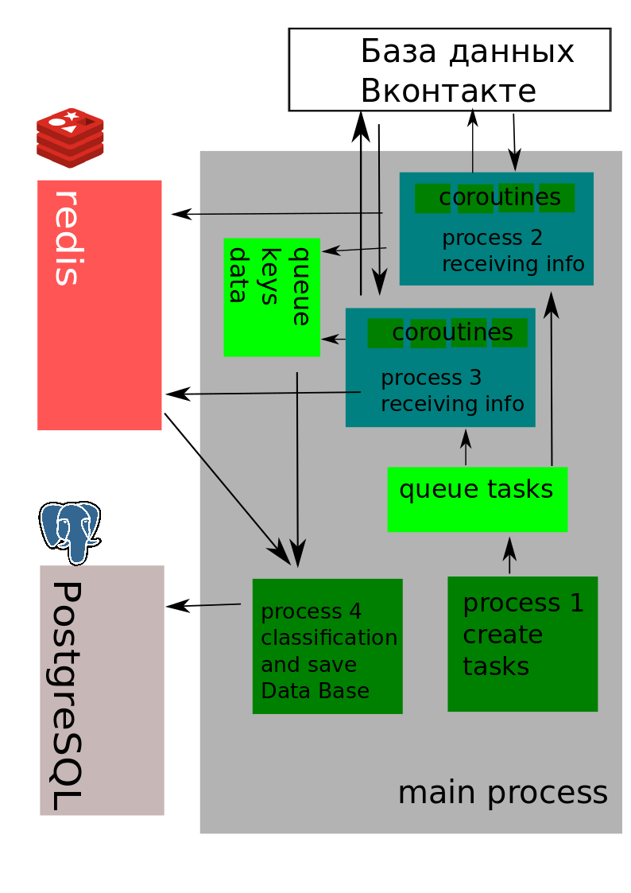

# Парсер групп Вконтакте обработка и анализ полученных данных с сохранением их в базу данных

Парсер собирает информацию о группах, классифицирует по категориям анализируя  описание группы и
полученные данные сохраняет в базу данных.
Для взаимодействия с базой Вконтакте использовался модуль aiovk
(API обертка для asyncio [[ссылка](https://github.com/Fahreeve/aiovk/)]. Для установки с помощью pip:
```
pip install aiovk
```
#### Получение прав доступа к API  Вконтакте
Чтобы взаимодействовать с API Вконтакте необходимо получить токен для этого в новой вкладке в браузере введите в адресную строку такой запрос:
```
https://oauth.vk.com/authorize?client_id=5490057&display=page&redirect_uri=https://oauth.vk.com/blank.html&scope=friends&response_type=token&v=5.52
```
Нажмите Enter. Откроется окно с запросом прав. В нем отображаются название приложения, иконки прав доступа, и
Ваши имя с фамилией.
Нажмите «Разрешить». Вы попадете на новую страницу с предупреждением о том, что токен нельзя копировать и передавать
третьим лицам. В адресной строке будет URL https://oauth.vk.com/blank.html,
а после # Вы увидите дополнительные параметры — access_token, expires_in и user_id. Токен может выглядеть, например, так
[[ссылка](https://vk.com/dev/first_guide?f=3.%20Авторизация%20пользователя)]:
```
51eff86578a3bbbcb5c7043a122a69fd04dca057ac821dd7afd7c2d8e35b60172d45a26599c08034cc40a
```
Для сохнанения токена следует создать файл psswd.json (ни кому не передавайте данный файл) по следующему шаблону:
 ```
{"security": 
    {
        "token_vk": "51eff86578a3bbbcb5c7043a122a69fd04dca057ac821dd7afd7c2d8e35b60172d45a26599c08034cc40a",
        "pswdbd": "password"
         }
}
```
 B вставить полученый токен в значене пареметра "token_vk".
 
 #### Реализация
 Работа скрипта основана на многопоточности, для этого использоваля модуль multiprocessing. Каждый тип опрераций выполнялся в отдельном
 процессе. Задача разбита на 3 подзадачи:
 - сбор данных о группах Вконтакте;
 - классификация групп по признакам;
 - сохранение в базу данных.


##### Сбор данных по API
Задание параметров сбора осуществляется с помошью  
Генерации при запуске скрипта с помощью параметров запуска:
```
"-l", "--log" - Logging space, default stdout
"-c", "--config" - Script config in json format
"-b", "--bdata" - Database name of processed information
"-s", "--startid" - Start id for parsing communities vk
"-n", "--numpackco" - Nunber of community processing packages
"-p", "--packreq" - Number of community ids in the request (max = 500, default=400)
``` 
Пример запуска:
```
python vk_pars.py -s 4587235 -n 30 -p 30
```
Авторизация и подключение к API осуществлялось следующими методами: 
```
async with aiovk.TokenSession(access_token=self.token) as session:
            self.api = aiovk.API(session)
```

Сбор информации о группах осуществляется с помощью метода group.getById [[ссылка](https://vk.com/dev/groups.getById)], в которую передаются следующие параметры:
```
Параметры:
group_ids - идентификаторы или короткие имена сообществ. Максимальное число идентификаторов — 500.
список слов, разделенных через запятую
fields - список дополнительных полей, которые необходимо вернуть. 
Например: city, country, place, description, cover.
Результат:
После успешного выполнения возвращает массив объектов, описывающих сообщества.
``` 
Список дополнительных полей загружается из конфиг файла (config.json):
```
"paramreq":
    {
        "filds": "site,status,type,city,country,contacts,description,wiki_page,start_date,activity,status,age_limits,main_section,members_count,place"
       }
    }
```
Формирование списка идентификаторов и запись в очередь обработки осуществляется в отдельном процессе:
```
class CreateTaskQueue(multiprocessing.Process):
    def __init__(self, queue, num_comm, start_ids=1, num_ids_chunk=100, req_per_sec=20):
        multiprocessing.Process.__init__(self)
        self.num_ids_chunk = num_ids_chunk
        self.start_ids = start_ids
        self.num_comm = num_comm
        self.req_per_sec = req_per_sec
        self.queue = queue

    def create_ids_str(self, start, n_id_ch,  r_p_sec):
        return [','.join(
            str(start + n_id_ch * item_p + item_id
            ) 
            for item_id in range(n_id_ch)) 
            for item_p in range(r_p_sec)
            ]

    def run(self):
        start_id = self.start_ids
        n = 1
        log.info('Will be create %s processes' % self.name)
        while True:
            if self.queue.qsize() < self.req_per_sec:
                request_package = self.create_ids_str(self.start_ids, self.num_ids_chunk, self.req_per_sec)
                for id_list in request_package:
                    self.queue.put(id_list)
                self.start_ids += self.num_ids_chunk * self.req_per_sec
            if self.start_ids > start_id + self.num_ids_chunk * (self.num_comm): 
                log.info('Process %s close' % self.name)
                break
            time.sleep(1)

```
Процесс следит за очердью заданий, чтобы не произошло более 20 запросов к ресурсу.
Далее два процесса сбора данных, которые организует загрузку посредством коррутин. Каждая коррутина берет из очереди
задание производит загрузку информации, выделение необходимых данных и кеширование данных в Redis.
```
class TaskVkPars(multiprocessing.Process):
    def __init__(self, queue, token, fields, store, queue_store, num_cor_tasks = 4, fields_out=FIELDS_OUT):
        multiprocessing.Process.__init__(self)
        self.queue = queue
        self.fields = fields
        self.token = token
        self.stop = False
        self.store = store
        self.queue_store = queue_store
        self.num_cor_task = num_cor_tasks
        self.fields_out = fields_out

    def extract_info(self, data):
        list_comm = []
        for item in data:
            dict_info_comm = {}
            for field in self.fields_out:
                if field in item:
                    dict_info_comm[field] = item[field]
                else:
                    dict_info_comm[field] = ''
            list_comm.append(dict_info_comm)
        return list_comm

    async def reqw(self):
        try:
            strquer = self.queue.get(timeout=1)
            if strquer is None:
                self.stop = True
                return
            data = await self.api.groups.getById(group_ids=strquer, fields=self.fields)
            list_comm = self.extract_info(data)
            str_list_comm = json.dumps(list_comm).encode('utf-8')
            key = 'rid' + hashlib.md5(str_list_comm).hexdigest()
            if self.store.set(key, str_list_comm, 360):
                self.queue_store.put(key)
        except Exception as e:
            log.info(e)
   
    async def start_task(self):
        tasks_cor = []
        for _ in range(self.num_cor_task):
            tasks_cor.append(acincio.create_task(reqw()))
        await asyncio.gather(*tasks_cor)

    async def main(self):
        async with aiovk.TokenSession(access_token=self.token) as session:
            self.api = aiovk.API(session)
            while True:
                if self.stop:
                    break
                try:
                    await asyncio.wait_for(self.reqw(), timeout=10)
                except asyncio.TimeoutError:
                    log.info('Error timeout request_period')
                await asyncio.sleep(1)
                
    def run(self):
        log.debug(self.name)
        log.info('Will be create %s processes' % self.name)
        asyncio.run(self.main())
        log.info('Process %s close' % self.name)
```
Отдельный поток следит за появлением данных в Redis, загружает их и 
производит классификацию используя обучающие данные из config.json:
```
{"train":  
    {
        "news": [
            "новости", 
            "новостной сайт",
            "новости сегодня",
            "новостной канал",
            "свежие новости",
            "деловые новости",
            "финансовые новости",
            "cми",
            "средства массовой информации",
            "интернет-сми",
            "информационный канал"
        ], 
        "entertainment": [
            "кино",
            "игры",
            "равлечения",
            "музыка",
            "разлекательный канал",
            "юмор",
            "игра",
            "смешное видео",
            "музыкальный канал",
            "фильмы",
            "кинофильмы"
        ]
        },
``` 
Классификация поисходит по методу К-ближайшего соседа, последством использования метода KNeighborsClassifier из модуля
sklearn.neighbors.
```
def group_classification(data, data_training, par_train, keys):
    list_comm_sig = preparation_data(data, keys)
    list_data_train = []
    y_train = []
    for key, value in data_training.items():
        for item in value:
            list_data_train.append(item)
            if key == par_train:
                y_train.append(1)
            else:
                y_train.append(0)
    list_comm_sig = [sign.lower() for sign in list_comm_sig]
    list_data_training = [sign.lower() for sign in list_data_train]
    full_data = list_comm_sig + list_data_training
    vector = TfidfVectorizer()
    x_data = vector.fit_transform(full_data)
    x_train = x_data[len(list_comm_sig):]
    knn_classif = KNeighborsClassifier(n_neighbors=2)
    knn_classif.fit(x_train,y_train)
    return knn_classif.predict(x_data[:len(list_comm_sig)])

```
После классификации просходит запись в базу данных.

### Выводы
Обучающей выборку данных необходимо расширить для устранения ложных срабатываний.
Для этого надо создать выборку из загруженных уже классифицированных данных.


 